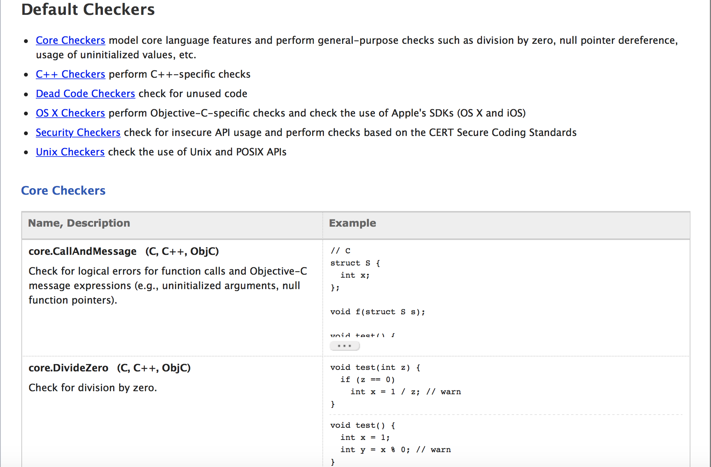
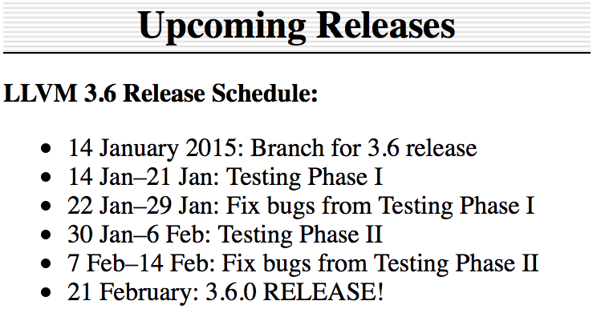
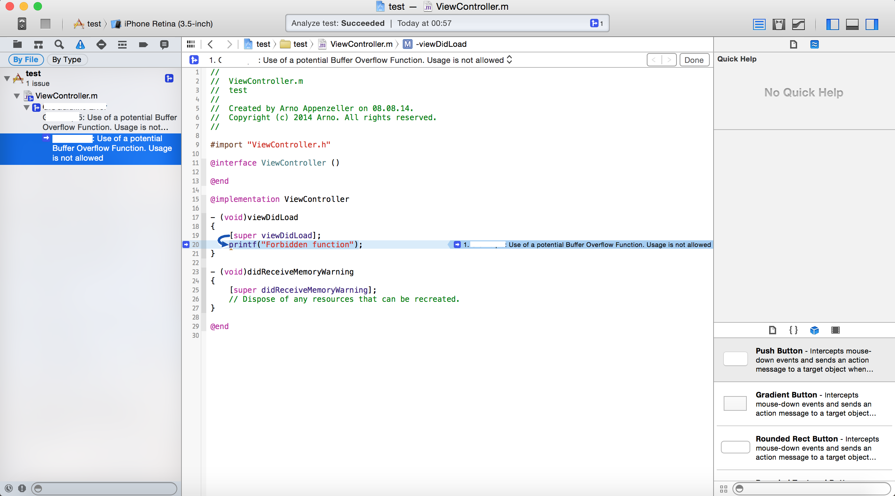
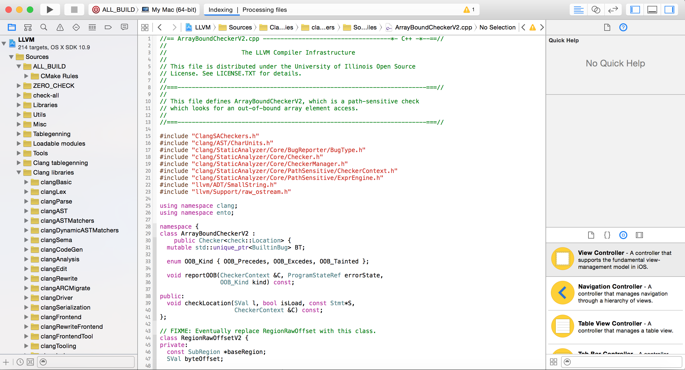

footer: Cocoaheads Frankfurt - Januar 2015 - Arno Appenzeller
slidenumbers: true

# Clang Static Analyzer erweitern und nutzen

---

# Was ist der Static Analyzer?

Der Clang Static Analyzer ist in Xcode integriert und Bestandteil des Compilers. Er wird dazu genutzt um den Code "statisch zu analysieren"

Statisch bedeutet der Code wird ohne ausgeführt zu werden auf bestimmte Eigenschaften untersucht.

---

# Was ist der Static Analyzer?

Der Analyzer besteht aus mehreren Checkern, die alle auf verschiedene Eigenschaften prüfen.

---

# Beispiel: Was kann der Analyzer von Haus aus?

- Ungenutzte Variablen finden

- Unerreichbare Code Abschnitt (Goto Fail Bug -> neuere Version von Clang hätte diesen finden müssen)

- Division durch Null feststellen

- Bestimmte andere Eigenschaften (z.B. super Call bei bestimmten Funktionen -> viewDidLoad)

---
# Beispiel: Was kann der Analyzer von Haus aus?

- Vollständige Liste: [http://clang-analyzer.llvm.org/available_checks.html](http://clang-analyzer.llvm.org/available_checks.html)



---

- Xcode Clang ist dem eigentlichen Clang in der Regel einige Versionsnummern hinten dran.

- **Selbst wenn man den Clang nicht erweitern möchte, findet ein neuerer Clang durchaus mehr oder andere Probleme im Code**

---

Siehe Xcode LLVM/Clang Version:


VS. LLVM Release Schedule:




---
# How to build your own Clang

1. LLVM & Clang auschecken. Siehe [http://llvm.org/docs/GettingStarted.html#getting-started-quickly-a-summary](http://llvm.org/docs/GettingStarted.html#getting-started-quickly-a-summary)
2. Build-Ordner erstellen
3. Im Ordner Terminal öffnen und 
```pathToLLVM/configure``` ausführen
4. Im Terminal: ```make -jN``` 
wobei ```N``` = Anzahl Prozessor + 1 (wesentlich schneller)

---

#Eigenen Clang-Analyzer benutzen

Zwei Möglichkeiten:

- Konsolenoutput für eine Datei: 
```yourClang -cc1 yourOBJCFile.m```

---

- ScanBuild HTML Ouput (mit ScanView): (Im Projektordner)  ```pathToScanBuild xcodebuild```


(Hinweis: `scanBuild` muss sich im Überordner relativ zum `bin`-Ordner des kompilierten Clang befinden)

---

#Eigenen Clang-Analyzer benutzen

Den aktuellsten Build findet man auch fertig kompiliert unter: [http://clang-analyzer.llvm.org](http://clang-analyzer.llvm.org)

---
#Eigenen Clang-Analyzer in Xcode einbinden

- In den Clang Quellen existiert Tool namens: `set-xcode-analyzer`
- ScanBuild muss wie oben beschrieben im übergeordneten Ordner zum Clang-bin-Ordner platziert sein
- Eignen Clang einstellen: 
```sudo ./set-xcode-analyzer --use-checker-build=PATH_TO_CLANGPARENTFOLDER_WITH_SCANBUILD```

---
#Eigenen Clang-Analyzer in Xcode einbinden

- Xcode Clang zurücksetzen:
```sudo ./set-xcode-analyzer --use-xcode-clang```
- Funktioniert nun über Analyze-Button

---
#Eigenen Clang-Analyzer in Xcode einbinden


---

# Clang erweitern - Warum?

- Umsetzung von (Unternehmens)-Richtlinien (Verbotene Funktionen, etc.)

- Verifizierung von Framework Verwendung

- Coding Styles

- Sicherheitserweiterungen, etc.

- (Außerdem ist es recht spannend 😜)


---
# Clang erweitern - Start

- Man kann aus der Clang Source ein Xcodeproject erstellen 

- wesentlich angenehmer zu entwicklen als mit Editor und Terminal

- ```cmake -G Xcode -DCMAKE_BUILD_TYPE=Debug pathToLLVMSource```


---
# Clang erweitern - Start




---
###Checker Plugin entwickeln - Basics

- Bestehende Checker befinden sich in 
```tools/clang/lib/StaticAnalyzer/Checkers```

- Checker, wie der gesamte LLVM/Clang, werden in C++ entwickelt

- Für einen neuen Checker einfach eine neue Datei im Checkers Ordner erstellen.

---
###Checker Plugin entwickeln - Basics

- Datei muss in der _CMakeLists.txt_ im Ordner hinzugefügt werden

- Checker muss in _Checkers.td_ registriert werden (später mehr)

---
###Checker Plugin entwickeln - Einfacher eigener Checker

Wir möchten auf C-Funktionsaufrufe wie *printf*,*strcat*,*strcpy*,*strncat* finden und davor warnen

*(Neuere Xcode Version haben dies bereits als Option für Warnings)*

---

###Checker Plugin entwickeln - Aufbau Checker I

- Ein Checker prüft auf bestimmte Events (z.B. `checkPreCall` das Statements vor ihrem "Aufruf" prüft -> Standardevent)

- Weitere Events: `checkPostCall`,`checkPreObjCMessage`,`checkEndFunction`,`checkDeadSymbols`,etc.

- Ein Event übergibt immer den aktuelle `CheckerContext`, der z.B. aktuellen CalleeIdentifier oder ASTContext enthält.

---

###Checker Plugin entwickeln - Aufbau Checker II

- Der aktuelle Callee wird als IdentifierInfo gespeichert, wir suchen in unserem Fall etwas wie *printf*

- *printf* ist nicht immer *printf* - wir müssen den passenden Identifier anhand des aktuellen AST initiieren:

```C++
IIprintf = &ASTContext.Idents.get("printf");
```

---

###Checker Plugin entwickeln - Aufbau Checker III

- Nun können wir im Event prüfen, ob der Identifier des aktuellen Context *printf* ist:

```C++
void CocoaheadSecurityFunctionChecker::checkPreCall(const CallEvent &Call, CheckerContext &C) const {
  initIdentifierInfo(C.getASTContext()); //initiiert die Identifier
  const IdentifierInfo *ID = Call.getCalleeIdentifier();

  //check if printf
  if ( ID == IIprintf){
  //throw bug
  }
}
```

---

###Checker Plugin entwickeln - Aufbau Checker IV

- Bugs erstellt man indem man sie zuerst Global definiert, via reset

```C++
boBug.reset(new BugType(this, "Potential BufferOverflow Function", "CocoaheadSecurityFunctionChecker Error"));
```

- Man wirft sie aus indem man dem Context einen Bugreport mit Bug-Art,Beschreibung und Location übergibt

```C++
ExplodedNode *ErrNode = C.generateSink(); //Location anhand des Context (Hinweis: Sink beendet alle weiteren Checks anhand dieses Ablaufs)
BugReport *bug = new BugReport(*boBug, "CocoaheadSecurityFunctionChecker: Use of a unsafe file handeling function. Usage is not allowed.", ErrNode); 
C.emitReport(bug); //auslösen des reports
```

---

###Checker Plugin entwickeln - Checker registrieren I

Ein Checker muss dem CheckerManager mitteilen, dass es ihn gibt:

```C++
void ento::registerCocoaheadSecurityFunctionChecker(CheckerManager &mgr) {
  mgr.registerChecker<CocoaheadSecurityFunctionChecker>();
}
```


---
###Checker Plugin entwickeln - Checker registrieren II

- In _Checkers.td_ sind alle Checker aufgelistet und in bestimmte Kategorien eingeteilt

- Um entwickelt Checker hinzuzufügen folgenden Code einfügen (in bestehende Kategorien - wir wählen _Security_)

```bash
let ParentPackage = Security in {
//a lot of other code
def CocoaheadSecurityFunctionChecker :Checker<"CocoaheadSecurityFunctionChecker">,
  HelpText<"Checks for security">,
  DescFile<"CocoaheadSecurityFunctionChecker.cpp">;
 }
 ```

 --- 

###Checker Plugin entwickeln - Fertigstellung

Konfiguration ALL_BUILD bauen:


Neuer Clang befindet sich nun in: "Debug/bin" (je nach Konfiguration)

(Kompletter Code hier: [github.com/arnoappenzeller](https://github.com/arnoappenzeller/modifyClangStaticAnalyzer))

---

###Checker Plugin entwickeln - Fazit

- Anhand dieser Grundlage lässt sich bereits ein einfacher eigner Checker erstellen.

- Für Objective-C ist das ganze etwas komplizierter, da hier mit Nachrichten und Selectors gearbeitet wird. 

- Ein komplexeres Beispiel ist auf [Github](https://github.com/arnoappenzeller/modifyClangStaticAnalyzer) (prüft ob ein JailbreakCheck durchgeführt wird, wenn ein bestimmter Parameter gesetzt ist)


---

#Links

1. [Clang Analyzer Seite](http://clang-analyzer.llvm.org)
2. [Checker Developer Manual] (http://clang-analyzer.llvm.org/checker_dev_manual.html)
3. [Clang Doxygen](http://clang.llvm.org/doxygen/) (Für komplexere Entwicklungen notwendig!)
4. "Building a Checker in 24 hours" (Talk von LLVM Dev Conference) [Slides](http://llvm.org/devmtg/2012-11/Zaks-Rose-Checker24Hours.pdf) [Video](http://llvm.org/devmtg/2012-11/videos/Zaks-Rose-Checker24Hours.mp4)

---
#Fragen/Kontakt?

* Per Twitter unter [@arno_app](https://twitter.com/arno_app)

* Github: [github.com/arnoappenzeller](http://github.com/arnoappenzeller/)

* Mehr über mich und meine iOS Projekte: [app-enzeller.com](http://app-enzeller.com)
